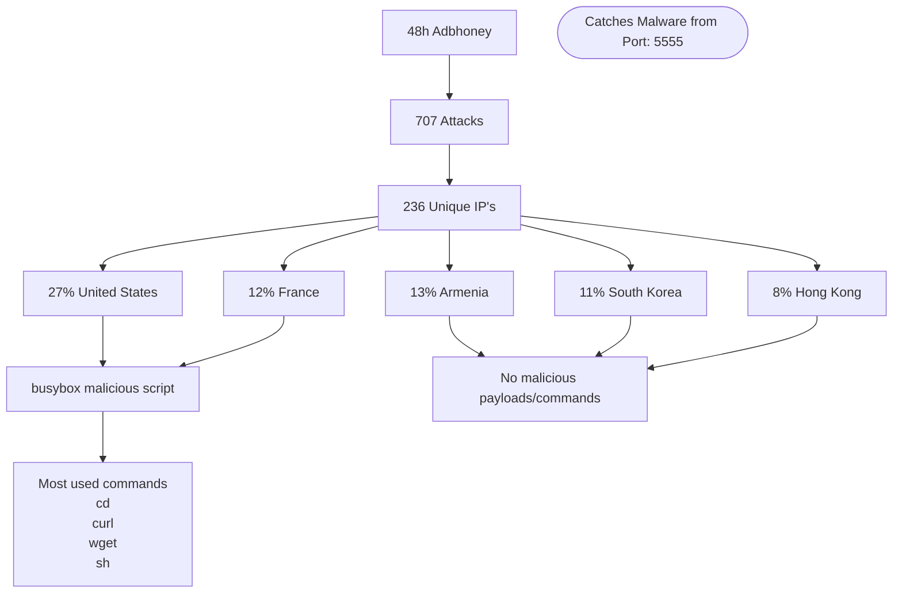
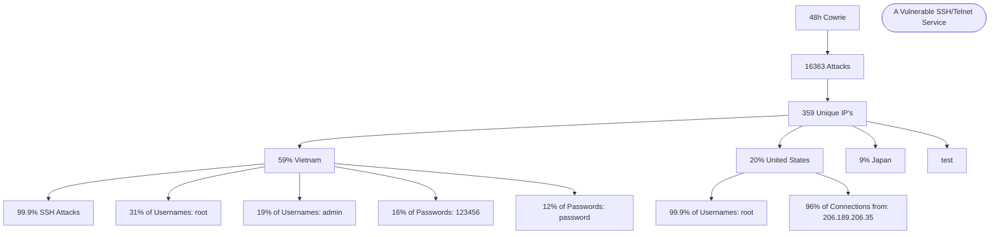

# In-Depth Data for T-Pot Project:

### Adbhoney Honeypot

```mermaid
flowchart TD
    A[48h Adbhoney] -->B[707 Attacks]
    B[707 Attacks] -->C[236 Unique IP's]
    C[236 Unique IP's] -->D[27% United States]
    C[236 Unique IP's] -->E[13% Armenia]
    C[236 Unique IP's] -->F[12% France]
    C[236 Unique IP's] -->G[11% South Korea]
    C[236 Unique IP's] -->H[8% Hong Kong]
    D[27% United States] -->I[busybox malicious script]
    E[13% Armenia] -->J[No malicious payloads/commands]
    F[12% France] -->I[busybox malicious script]
    G[11% South Korea] -->J[No malicious payloads/commands]
    H[8% Hong Kong] -->J[No malicious payloads/commands]
    I[busybox malicious script] --> K[Most used commands <br> cd<br>curl<br>wget<br>sh<br>]
id1([Catches Malware from Port: 5555 ])
```

### Cowrie Honeypot

```mermaid
flowchart TD
A[48h Cowrie] -->B[16363 Attacks]
    B[16363 Attacks] -->C[359 Unique IP's]
    C[359 Unique IP's] -->D[59% Vietnam]
    C[359 Unique IP's] -->E[20% United States]
    C[359 Unique IP's] -->F[9% Japan]
    D[59% Vietnam] -->G[99.9% SSH Attacks]
    D[59% Vietnam] -->H[31% of Usernames: root]
    D[59% Vietnam] -->I[19% of Usernames: admin]
    D[59% Vietnam] -->J[16% of Passwords: 123456]
    D[59% Vietnam] -->K[12% of Passwords: password]
E[20% United States] -->L[99.9% of Usernames: root]
E[20% United States] -->M[96% of Connections from: 206.189.206.35]
C[359 Unique IP's] -->N[test]
id1([A Vulnerable SSH/Telnet Service])
```
